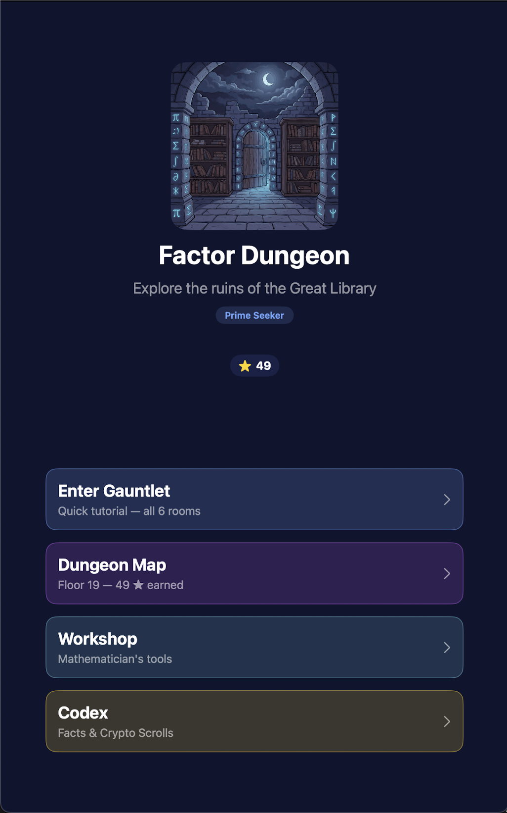
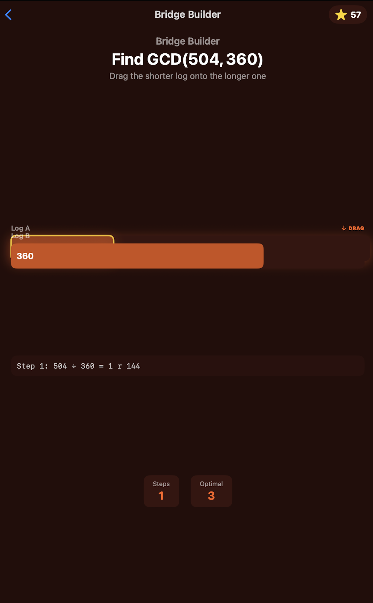
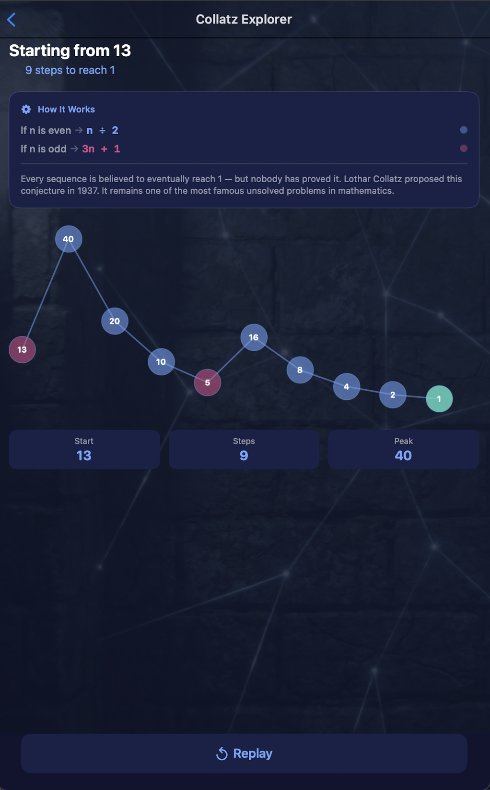

# Factor Dungeon

Factor Dungeon is a SwiftUI app playground that turns number theory into a dungeon crawler. Players solve small puzzle rooms about prime factors, multiples, modular arithmetic, GCD, LCM, and remainders.

I built this project because I wanted a fun game I could demo to younger kids while showing that math can be interactive. I first learned some Swift a few years ago from a Swift for Kids book, but I had not kept up with it much since then. Factor Dungeon became my first bigger SwiftUI app and a way to update and improve my Swift knowledge.

## Screenshots

| Main Menu | Bridge Builder | Collatz Explorer |
| --- | --- | --- |
|  |  |  |

## Why I Built It

The idea came from wanting to make a math project that younger students would actually want to try. I liked the idea of turning number theory into a dungeon game, then using that game to show that topics like prime numbers and modular arithmetic can connect to real things like passwords and secure websites.

I wanted the app to feel playful first, then let the math show up through the puzzles. The goal was to make something simple enough to demo, but still big enough for me to practice real app structure, navigation, state, animations, and saving progress.

## What It Does

Factor Dungeon has six puzzle rooms:

- Factor Forge: break a number into prime factors.
- Sieve Strike: identify multiples of a prime in a number grid.
- Mod Clock: solve clock-style modular arithmetic.
- Bridge Builder: use the Euclidean algorithm to find the GCD.
- Flood Gate: line up two repeating cycles using the LCM.
- Cipher Lock: solve modular conditions inspired by the Chinese Remainder Theorem.

As players progress, they earn stars, unlock new dungeon floors, collect short math and cryptography facts in the Codex, and repair the Mathematician's Workshop. The Workshop works like a sandbox where students can test numbers, view factors and divisors, check primality, explore modular tables, and animate Collatz sequences.

## Who It Helps

The main audience is middle school students who are meeting abstract math for the first time. Visual learners especially benefit because the app shows how numbers interact instead of only asking them to memorize an algorithm.

I also built it with tutors and educators in mind. The Workshop can be used during a lesson or homework session as a quick visual calculator, so the app is not only a game but also a teaching tool.

## Accessibility

I tried to make accessibility part of the design instead of something added at the end. Color is used for theme and feedback, but it is not the only signal. The app also uses shapes, SF Symbols, text labels, and haptic feedback to make correct and incorrect actions feel different.

The interface uses SwiftUI's semantic text styles like title, headline, body, and caption instead of fixed font sizes, which helps support Dynamic Type. I also added accessibility labels and hints to important interactive views so VoiceOver users can better understand tools, tiles, and actions.

## Technologies

Factor Dungeon is built with SwiftUI. I used the Observation framework for the shared GameState so screens update automatically when progress changes. UserDefaults stores small pieces of progress like the current floor, stars, completed rooms, and unlocked scrolls.

I also used Timer in rooms that depend on time, including countdowns and repeating cycle animations. Haptic feedback makes correct answers, mistakes, taps, and rewards feel more physical. SF Symbols are used throughout the interface for clear icons without needing extra image assets.

## AI Usage

I used Google Gemini to help create the game's image assets, proofread text, and polish the overall project structure. I also used AI as a learning tool when I had questions about SwiftUI patterns, NavigationStack, state management, animations, and debugging.

I designed the game mechanics and built the Swift implementation myself.

## Reflection

This was my first larger SwiftUI project after coming back to Swift. I practiced state, navigation, animations, haptics, and organizing a bigger app while building something I could demo to younger students. I am currently learning Python too, but this project reminded me how much I enjoy SwiftUI and building visual interfaces. I hope to explore more game development when I have more time outside of math.
